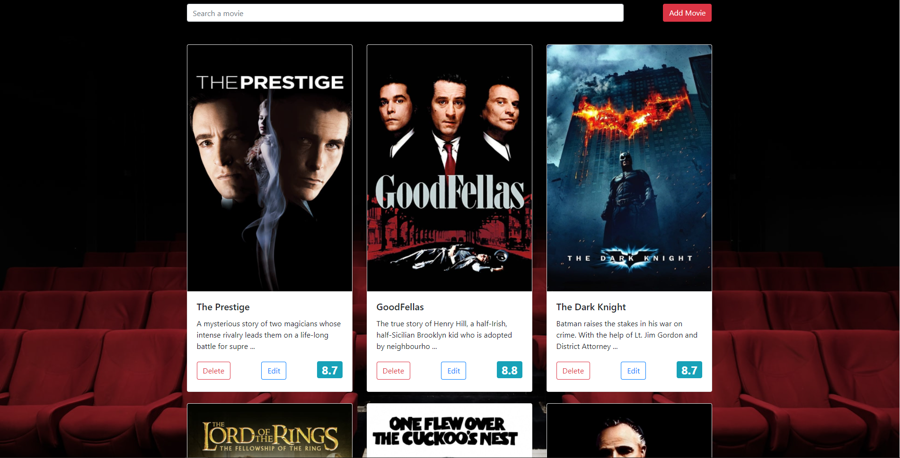
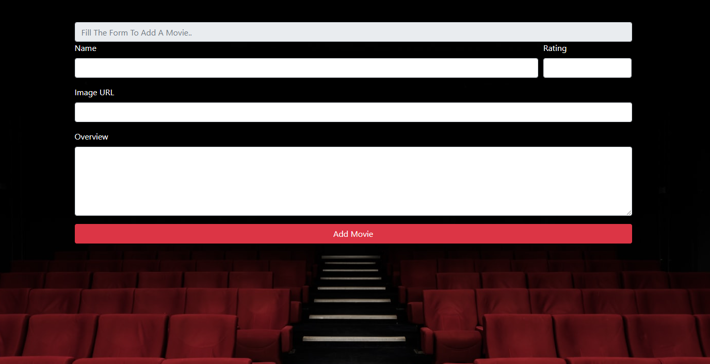
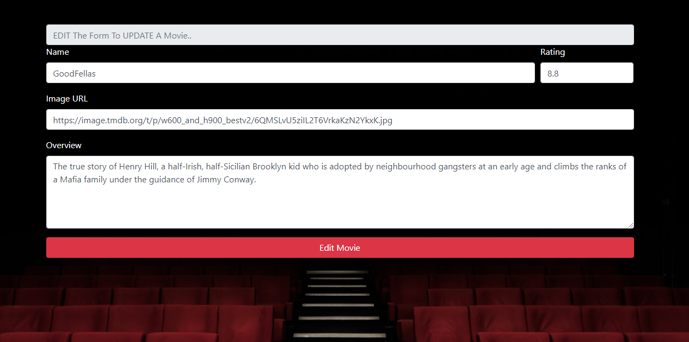

# MovieList-React-CRUD
Created with ReactJs
- Create
- Read
- Update
- Delete 
- Responsive design

### `npx json-server --watch src/api/movies.json --port 3002`
Firstly open the terminal and start json-server

### `npm start`

Runs the app in the development mode. 
Open [http://localhost:3000](http://localhost:3000) to view it in the browser.

### You are 100% allowed to use this webpage for both personal and commercial use, but NOT to claim it as your own design. :+1: 
